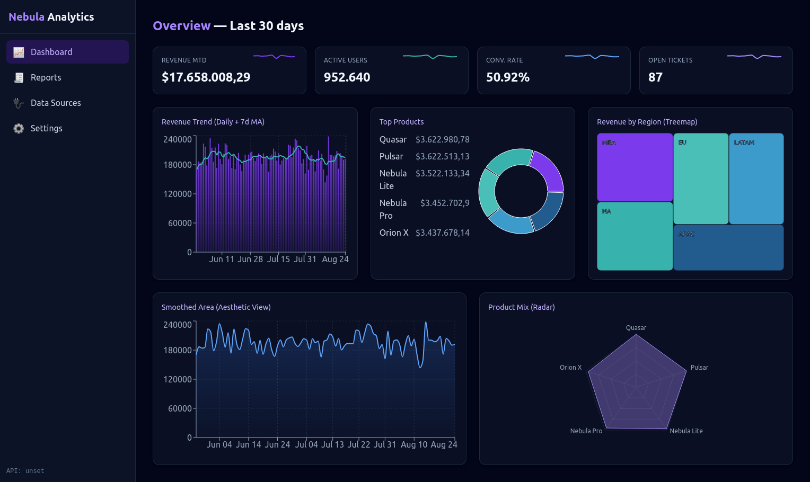
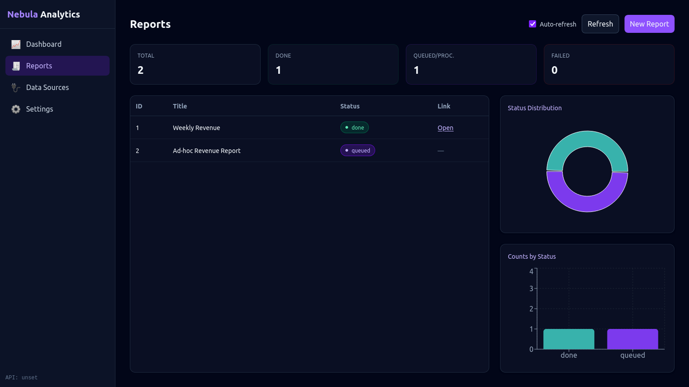
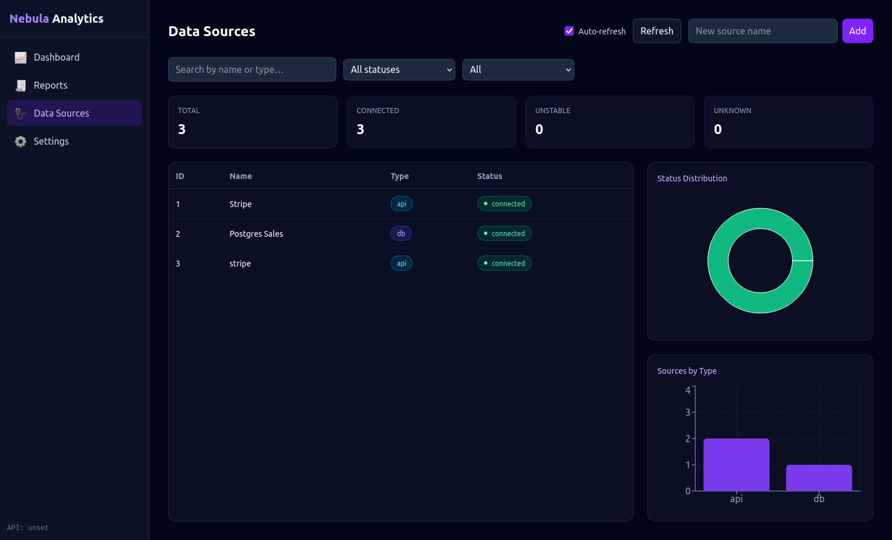
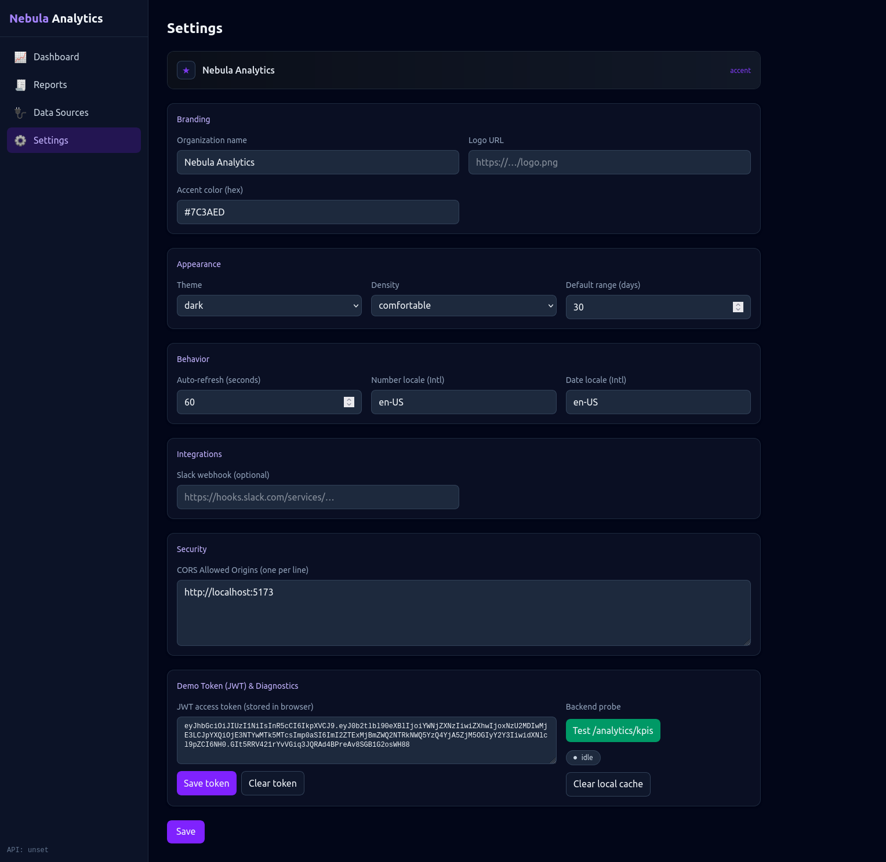

# 🌌 Nebula Analytics — Django + DRF + JWT + React + Vite (Dark UI)

A modern analytics suite with a sleek dark dashboard: KPIs, trends, top products and regional breakdowns.  
Built to be modular, extensible and portfolio‑ready.

## ✨ Features
- **Backend (Django + DRF)**
  - JWT auth (SimpleJWT)
  - Analytics endpoints: KPIs, Trend, Top Products, Distribution
  - Stubs para Data Sources / Reports / Settings (com rotas prontas)
  - Seed script para dados sintéticos
  - CORS configurado para o front
- **Frontend (React + Vite + Tailwind)**
  - Dashboard dark elegante (Recharts)
  - Páginas: Dashboard, Reports, Data Sources, Settings
  - Layout responsivo e componentes reutilizáveis

## 🧰 Prerequisites
- **Python 3.10+** 
- **Node 18+** (Vite/Recharts)

## 🚀 Setup — Backend
```bash
cd backend
python -m venv .venv
source .venv/bin/activate   # Windows: .venv\Scripts\activate
pip install -r requirements.txt

cp .env.example .env

python manage.py migrate
python manage.py createsuperuser

python manage.py seed_analytics --days 90

python manage.py runserver

curl -X POST http://127.0.0.1:8000/api/accounts/jwt/create/ \
  -H "Content-Type: application/json" \
  -d '{"username":"<seu-usuario>","password":"<sua-senha>"}'
```

## 🚀 Setup — Frontend
```bash
cd frontend
npm install
cp .env.example .env   
npm run dev

localStorage.setItem('nebula_token', '<SEU_ACCESS_TOKEN>');
```

## 🔗 Endpoints
```
GET /api/analytics/kpis/
GET /api/analytics/trend/?days=30
GET /api/analytics/top-products/
GET /api/analytics/distribution/
GET/POST /api/datasources/ (stub)
GET/POST /api/reports/ (stub)
GET/POST /api/settings/ (stub)

python manage.py seed_analytics --days 90
```

## 📦 Production
- DEBUG=False, ALLOWED_HOSTS configurado
- Postgres + Gunicorn + Nginx
- Static/media via S3/Cloud Storage (ou Nginx)
- TLS (Let's Encrypt)
- CI/CD opcional (GitHub Actions)

## 📸 Screenshots






## 📝 License
MIT — use freely.


